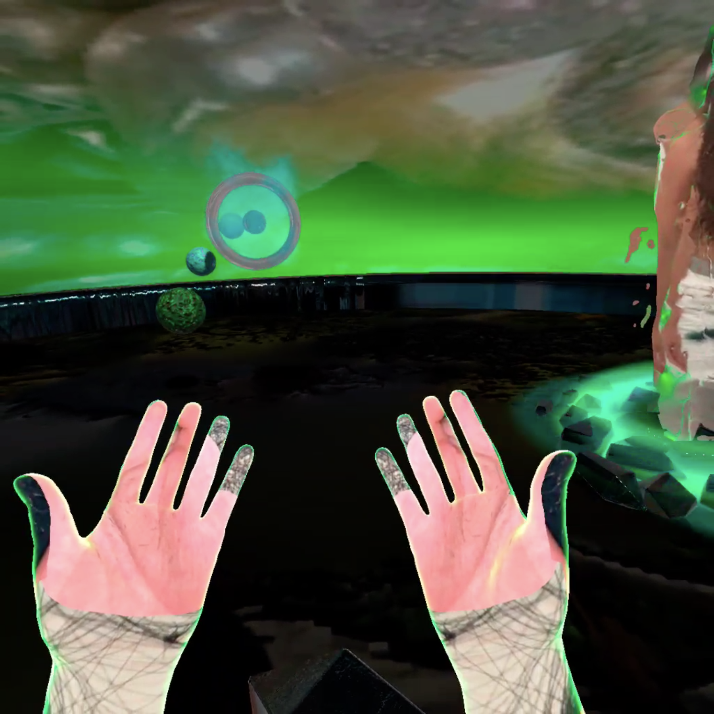
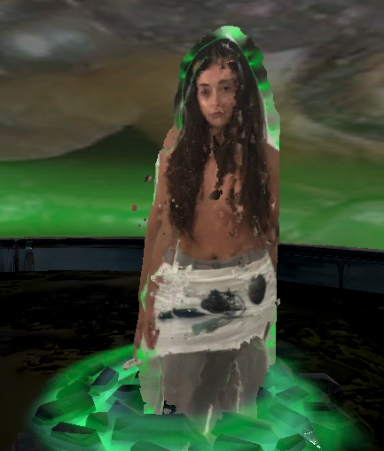
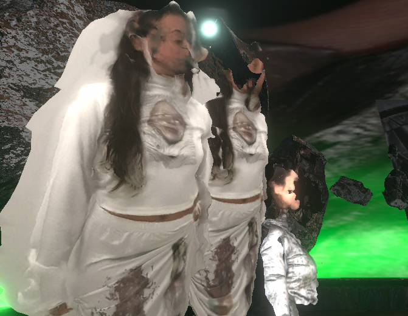

# EonHey-VR-Experience

"Melting in peace" demo was made in collaboration with Magdalena Hart an UK artist based in Barcelona for the Korean fashion brand [EonHey](https://www.eonhey.com/). The purpose of this project was exploring virtual landscapes though a VR experience enhancing the brand collection concept.

Try the release!

## [Showcase video](https://www.youtube.com/embed/sJ4Azj-qR18)

    
  
  

 

  

